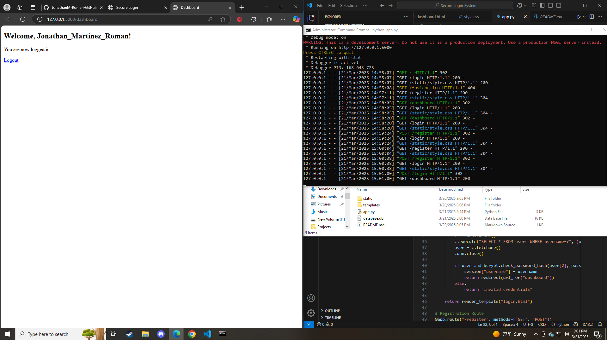

## **4️⃣ Secure Login System (HTML/CSS/JavaScript, SQL) 🔑**

### **Description**
A secure web-based authentication system with hashed passwords and user roles (admin/user). Enhances login security for web apps.

## Screenshot





### **Tech Stack**
- HTML, CSS, JavaScript
- SQL
- bcrypt for password hashing

### **Installation & Usage**
```bash
# Clone the repository
git clone https://github.com/yourgithub/Secure-Login.git
cd Secure-Login

# Start the local server
python -m http.server 8080
